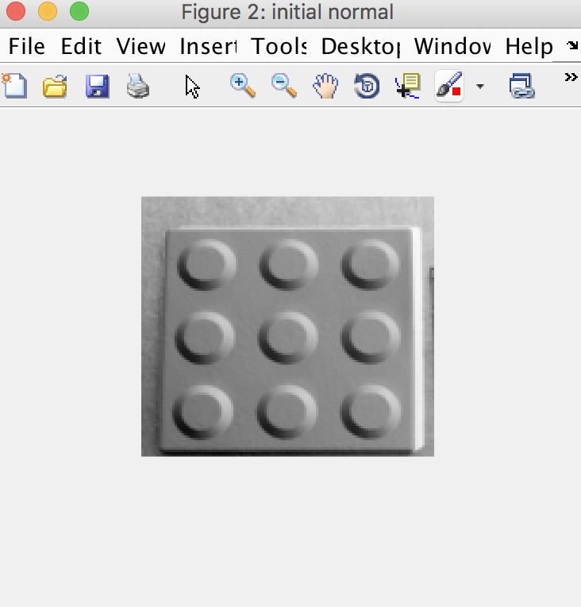
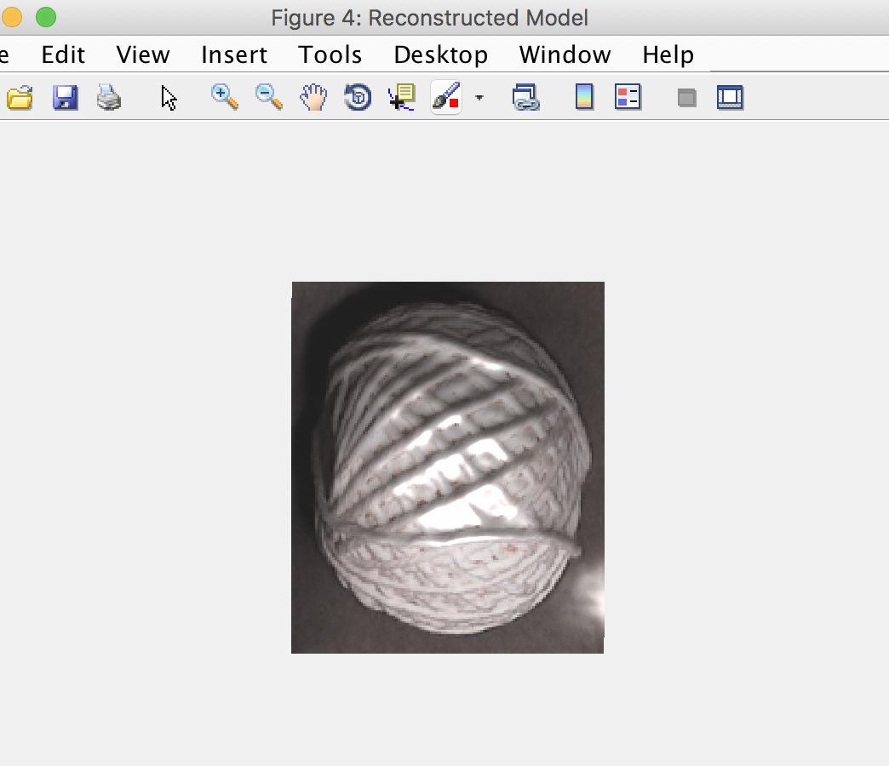

## Dense Photometric Stereo

### General Idea
This is a project on photometric stereo reconstruction. An object is observed by a fixed camera under different illumination. So we have a dense set of images to start with. The challenge is to infer a 2.5D surface description of the object (that is, a depth model), despite that the captured data are severely contaminated by shadows, highlights, transparency and that the light calibration is inaccurate. 

### Reference Paper
[Dense Photometric Stereo Using a Mirror Sphere and Graph Cut](https://github.com/jguoaj/dense-photometric-stereo/blob/master/dense-photometric-stereo.pdf)

### Methodology
The steps of the project are:

	1: uniform resampling
	2: find denominator image
	3: initial normal estimation
	4: refine normals by MRF graph cut
	5: contruct 3D models

### Results
In this part, we include several examples to demonstrate.

example 02

example 03

example 04

example 05

example 06

example 07

example 08

example 09

example 10

